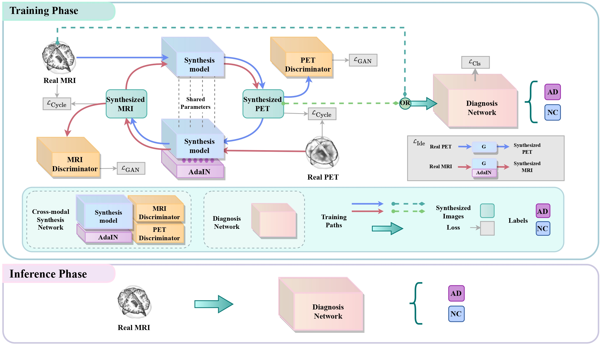
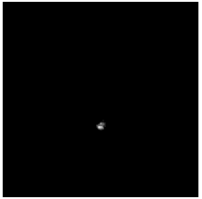
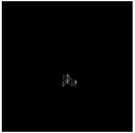
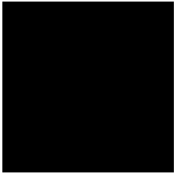
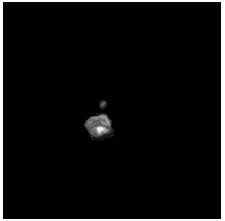
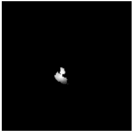
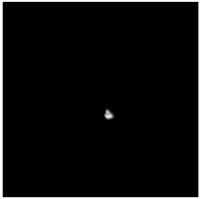
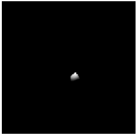
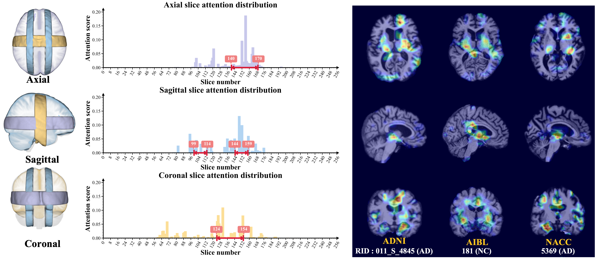

# Joint learning for Alzheimer's disease

**[MedIA 2024]** This is a code implementation of the **joint learning framework** proposed in the manuscript "**Joint learning Framework of cross-modal synthesis and diagnosis for Alzheimer's disease by mining underlying shared modality information**".[[Paper]](https://doi.org/10.1016/j.media.2023.103032) [[Supp.]](./readme_files/main_supp.pdf)

🌟🌟🌟 We also plan to open a **unified codebase for 3D cross-modality medical synthesis** in [[code]](https://github.com/thibault-wch/A-Unified-3D-Cross-Modality-Synthesis-Codebase), including **updated multi-thread preprocessing steps for MRI and PET**, **a series of generated methods** (CNN-based, GAN-based, and Diffusion-based), and **full evaluation pipelines for 3D images**.

## Introduction
Among various neuroimaging modalities used to diagnose AD, functional positron emission tomography (**PET**) has higher sensitivity than structural magnetic resonance imaging (**MRI**), but it is also **costlier and often not available** in many hospitals.
How to **leverage massive unpaired unlabeled PET to improve the diagnosis performance of AD from MRI** becomes rather important. 
To address this challenge, this paper proposes a novel **joint learning framework of unsupervised cross-modal synthesis and AD diagnosis by mining underlying shared modality information**, improving the AD diagnosis from MRI while synthesizing more discriminative PET images.
Additionally, our method is evaluated at the same internal dataset (**ADNI**) and two external datasets (**AIBL and
NACC**), and the results demonstrated that our framework has good generalization ability.

### Overall joint learning framework

  

### Unsupervised Synthesized PET Demo (ShareGAN)

To diversify the modality information, we propose a novel **unsupervised cross-modal synthesis network** that implements
the inter-conversion between **3D PET** and **MRI** in a **single** model modulated by the AdaIN module. Here, we
present the **unsupervised** synthesized PET image demo by our ShareGAN after joint training with the downstream
diagnosis network.

| Slice direction | Real MRI                                                                           | Our unsupervised <br> synthesized PET                                                    | Real PET                                                                           |
|-----------------|------------------------------------------------------------------------------------|------------------------------------------------------------------------------------------|------------------------------------------------------------------------------------|
| Axial           |        |        |        |
| Sagittal        |  |  |  |
| Coronal         |    |    |    |

### Interpretability Demo

To locate shared critical diagnosis-related patterns, we propose an **interpretable diagnosis network based on fully 2D
convolution**s, which takes either 3D synthesized PET or original MRI as input. The regions of interest located by our
network are consistent with those associated with AD, such as **the ventricles and hippocampus.**


# Usage

### Install requirements

First clone the repository:

```bash
git clone https://github.com/thibault-wch/Joint-Learning-for-Alzheimer-disease.git
```

And then install other requirements:

```bash
pip install -r requirements.txt
```

### Data preparation

We trained, validated and tested the framework using the Alzheimer's Disease Neuroimaging
Initiative ([ADNI](https://adni.loni.usc.edu/)) dataset. To
investigate the generalizability of the framework, we externally tested the framework on the National Alzheimer's
Coordinating Center ([NACC](https://naccdata.org/)), and the Australian Imaging Biomarkers and Lifestyle Study of
Ageing ([AIBL](https://aibl.csiro.au/)) datasets.
In order to comply with the data requirements of different databases, we have only made the subjectID available
at `./subject_ids.xlsx` for visitors to download.

We first use Freesurfer, Flirt and Ants for preprocessing all MRI and PET images (see Supp. B for details). Furthermore,
we transform the preprocessed `.nii.gz` brain files into `.npy` format.
In addition, we reorganize and split them into the data pairs for `./utils/UnpairedDataset.py` using `pickle`, the
concrete data pair demo as shown in:

```python
[
    (  # the MRI file path
        '/data/chwang/final_dataset_MRI/lineared/train/0_141_S_0810.npy',
        # the PET file path 
        # (unpaired for ADNI training set, but paired for ADNI validation and test set)
        '/data/chwang/final_dataset_PET/lineared/train/0_941_S_4376.npy',
        # the diagnosis label of the corresponding MRI subject (NC:0, AD:1)
        0),
    (   '/data/chwang/final_dataset_MRI/lineared/train/1_137_S_0841.npy',
        '/data/chwang/final_dataset_PET/lineared/train/0_068_S_4424.npy',
        1),
    (   '/data/chwang/final_dataset_MRI/lineared/train/1_099_S_0372.npy',
        '/data/chwang/final_dataset_PET/lineared/train/1_023_S_4501.npy',
        1)
        ...
    ]
```

Note that the element of external AIBL and NACC testing data pairs only have **the MRI file path** and **the diagnosis
label**.

### Training details

We implement the proposed method in the **PyTorch** library and train them on **2 NVIDIA V100 32G** Tensor
Core GPUs.
All the networks are initialized by the **kaiming** method and trained
using the Adam optimization algorithm with $\beta_1 = 0.5$ and $\beta_2 = 0.999$.
We use the **early stopping** method to select better network weights during the training phase.
The concrete training process consists of three stages, and we have organized them in `./scripts`.

#### Stage 1 : Pre train the cross-modal synthesis network with the image size of $128^3$

```bash
cd ./scripts/pretraining_stage
sh share_gan_128.sh
```

#### Stage 2 : Pre train the synthesis and the diagnosis networks separately with the image size of $256^3$

```bash
cd ./scripts/pretraining_stage

# pre-train the cross-modal synthesis network
sh share_gan_256.sh

# pre-train the diagnosis network
sh diag_pretrain.sh
```

#### Stage 3: Joint train for both the networks
First, move the weights of the pre-trained cross-modal and diagnosis networks to the directory stored for the joint training process. Make sure to rename them with the prefix 'pretrained'. Then, execute the provided shell script.
```bash
cd ./scripts/joint_stage
sh joint_learning.sh
```
### Inference details
We also provide the inference codes for the synthesis model and diagnosis network.
```bash
cd ./scripts
# for synthesis model
sh test_G.sh
# for diagnosis network
sh test_Cls.sh
```
## Folder structure

```
Joint_Learning_for_Alzheimer_disease
  ├─ components 
  │   ├─ AwareNet <our diagnosis network> 
  │   ├─ ShareSynNet <our synthesis model>
  │   └─ ...
  ├─ models
  │   ├─ joint_gan_model <our joint learning framework>
  │   ├─ share_gan_model <our cross-modal synthesis network>
  │   └─ ...
  ├─ options (different options)
  ├─ scripts (different stages' scripts)
  ├─ utils
  │   ├─ UnpairedDataset <our defined dataset>
  │   ├─ earlystop
  │   └─ ...
  ├─Diag_pretrain.py 
  ├─Diag_test.py 
  ├─Frame_train.py
  ├─Frame_test.py
  ├─README.md
  ├─requirements.txt
  ├─subject_ids.xlsx
```

# Acknowledgement

- We gratefully thank the **ADNI**, **AIBL**, and **NACC** investigators for providing access to the data.

- Our code is inspired by [TSM](https://github.com/mit-han-lab/temporal-shift-module),[Restormer](https://github.com/swz30/Restormer), [pytorch-CycleGAN-and-pix2pix](https://github.com/junyanz/pytorch-CycleGAN-and-pix2pix),and [SwitchableCycleGAN](https://github.com/YSerin/TMI_SwitchableCycleGAN).

## Citation
If you find this work useful for your research, please 🌟 our project and cite [our paper](https://doi.org/10.1016/j.media.2023.103032) :

```
@article{wang2024joint,
  title = {Joint learning framework of cross-modal synthesis and diagnosis for Alzheimer’s disease by mining underlying shared modality information},
  author = {Wang, Chenhui and Piao, Sirong and Huang, Zhizhong and Gao, Qi and Zhang, Junping and Li, Yuxin and Shan, Hongming and others},
  journal = {Medical Image Analysis},
  volume = {91},
  pages = {103032},
  year = {2024},
  publisher = {Elsevier}
}
```

